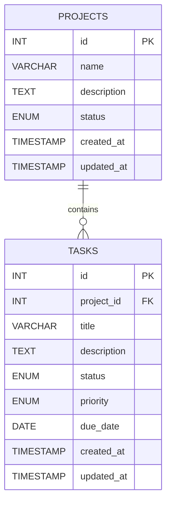

# Task Management System

A full-stack task management application built with React, Node.js, Express, and MySQL. Users can create projects, add tasks, filter and search tasks, update task progress, and complete a project only after all related tasks are completed.

## Submission Structure

```text
TaskManagementSystem/
  frontend/                 React + Vite application
  backend/                  Express REST API
  database/schema.sql       MySQL database schema
  README.md                 Main project documentation
```

Detailed module documentation is also available in:

- [Frontend README](frontend/README.md)
- [Backend README](backend/README.md)

## Technology Stack

- Frontend: React 19, React Router, Vite
- Backend: Node.js, Express 5
- Database: MySQL 8+
- Database client: `mysql2/promise`
- Configuration: `dotenv`
- Validation: Server-side validation with shared frontend form validation

## Requirements

- Node.js 18 or newer
- MySQL 8 or newer
- npm

## Setup Instructions

### 1. Clone and enter the repository

```powershell
git clone https://github.com/Utkarsh-2711/Task_management_app.git
cd Task_management_app
```

### 2. Configure the backend environment

Create `backend/.env` locally. Do not commit this file because it contains database credentials.

```env
PORT=5000
DB_HOST=localhost
DB_PORT=3306
DB_USER=root
DB_PASSWORD=your_mysql_password
DB_NAME=task_management
```

### 3. Install and start the backend

```powershell
cd backend
npm install
npm run dev
```

The backend runs at `http://localhost:5000`.

### 4. Install and start the frontend

Open a second terminal:

```powershell
cd frontend
npm install
npm run dev
```

Open the Vite URL shown in the terminal, normally `http://localhost:5173`.

### 5. Database setup

The backend automatically reads and executes `database/schema.sql` during startup. The schema creates:

- The `task_management` database
- The `projects` table
- The `tasks` table
- The foreign key relationship and indexes

MySQL must be running before starting the backend. Manual setup is also possible:

```sql
SOURCE database/schema.sql;
```

The configured MySQL user must have permission to create the database and tables.

## Application Features

- Create, list, view, update, and delete projects.
- Create, list, view, update, and delete tasks.
- Assign every task to an existing project.
- Set task status, priority, description, and due date.
- Search task titles.
- Filter tasks by project, status, and priority.
- Mark `todo` and `in_progress` tasks as completed.
- Complete a project only after every related task is completed.
- Reopen a completed project if required.
- Responsive mobile-first interface with mobile navigation drawer.
- Form validation and user-friendly API error messages.

## API Endpoints

Base URL:

```text
http://localhost:5000/api
```

### Health

| Method | Endpoint      | Description                      |
| ------ | ------------- | -------------------------------- |
| GET    | `/api/health` | Check API and MySQL availability |

### Projects

| Method | Endpoint            | Description                    |
| ------ | ------------------- | ------------------------------ |
| POST   | `/api/projects`     | Create a project               |
| GET    | `/api/projects`     | List all projects              |
| GET    | `/api/projects/:id` | Get one project with its tasks |
| PUT    | `/api/projects/:id` | Update a project               |
| DELETE | `/api/projects/:id` | Delete a project and its tasks |

### Tasks

| Method | Endpoint         | Description   |
| ------ | ---------------- | ------------- |
| POST   | `/api/tasks`     | Create a task |
| GET    | `/api/tasks`     | List tasks    |
| GET    | `/api/tasks/:id` | Get one task  |
| PUT    | `/api/tasks/:id` | Update a task |
| DELETE | `/api/tasks/:id` | Delete a task |

Task filters use query parameters:

```text
GET /api/tasks?projectId=1&status=in_progress&priority=high&search=login
```

Supported filters:

- `projectId`
- `status`: `todo`, `in_progress`, `completed`
- `priority`: `low`, `medium`, `high`
- `search`: searches task titles

## Example API Requests

Create a project:

```http
POST /api/projects
Content-Type: application/json
```

```json
{
    "name": "Website Development",
    "description": "Build the company website"
}
```

Create a task:

```http
POST /api/tasks
Content-Type: application/json
```

```json
{
    "project_id": 1,
    "title": "Create login page",
    "description": "Build the login interface",
    "status": "todo",
    "priority": "high",
    "due_date": "2026-09-30"
}
```

## Database Schema and ER Diagram

The application uses two normalized tables with a one-to-many relationship:



### Relationship

- One project can have zero or many tasks.
- Every task belongs to exactly one project through `tasks.project_id`.
- `tasks.project_id` references `projects.id`.
- `ON DELETE CASCADE` removes a project's tasks when the project is deleted.

### Allowed Values

Project status:

```text
active, completed
```

Task status:

```text
todo, in_progress, completed
```

Task priority:

```text
low, medium, high
```

The schema also indexes `project_id`, `status`, `priority`, and `title` to support common filters and lookups.

## Validation and Business Rules

- Project names cannot be empty.
- Task titles cannot be empty.
- Project and task IDs must be positive integers.
- A task must reference an existing project.
- Due dates must be valid `YYYY-MM-DD` calendar dates.
- Project and task enum values are validated before database writes.
- Missing resources return `404`.
- Invalid request data returns `400`.
- Malformed JSON returns `400`.
- Oversized request bodies return `413`.
- Unsupported request encoding returns `415`.
- MySQL connection failures return `503`.
- Unexpected server failures return a safe `500` response.

### Project Completion Rule

A project cannot be marked as `completed` if any related task is still `todo` or `in_progress`.

Example response:

```json
{
    "success": false,
    "message": "Project cannot be completed because some tasks are still pending."
}
```

This rule is enforced in the backend, not only in the frontend, so direct Postman or Hoppscotch requests cannot bypass it.

## Response Format

Successful responses use `success: true` and return data when applicable:

```json
{
    "success": true,
    "data": {}
}
```

Error responses use `success: false` and a readable message:

```json
{
    "success": false,
    "message": "Task must belong to an existing project."
}
```

## Assumptions

- This is a local or single-server assignment application; authentication and authorization are outside the assignment scope.
- The application uses one MySQL database configured through `backend/.env`.
- A task has one parent project and cannot exist without that project.
- A project with no tasks cannot be completed because completion requires all project tasks to be completed.
- Due dates are optional; when supplied, they represent a calendar date rather than a time.
- The frontend and backend run locally on separate development ports.
- The backend owns business-rule enforcement, while frontend validation improves user feedback.

## Design Decisions

- Controllers contain business logic and validation close to the related API operation.
- Routes remain small and use a shared async error wrapper.
- Database queries use parameter placeholders to reduce SQL injection risk.
- Centralized error middleware keeps API errors consistent.
- The frontend uses a shared `request()` helper to avoid duplicated fetch logic.
- The schema uses a foreign key and cascade delete to preserve relational integrity.
- Mobile-first CSS provides a usable small-screen layout before desktop enhancements.

## Possible Improvements

- Add authentication and role-based authorization.
- Add pagination for large task lists.
- Add server-side debounced search and full-text indexes for larger datasets.
- Add automated unit, integration, and end-to-end tests.
- Move the frontend API URL to a Vite environment variable for deployment.
- Add request rate limiting, security headers, and structured logging.
- Add transactions for multi-step workflows that grow more complex.
- Add Docker and CI/CD configuration for repeatable deployment.
- Add task assignment, labels, comments, and activity history.

## Quality Checks

Frontend:

```powershell
cd frontend
npm run lint
npm run build
```

Backend syntax checks can be run from the backend directory:

```powershell
cd backend
node --check src/server.js
node --check src/config/db.js
node --check src/controllers/project.controller.js
node --check src/controllers/task.controller.js
```

Health check:

```text
GET http://localhost:5000/api/health
```

A successful health response confirms that the API can reach MySQL.
